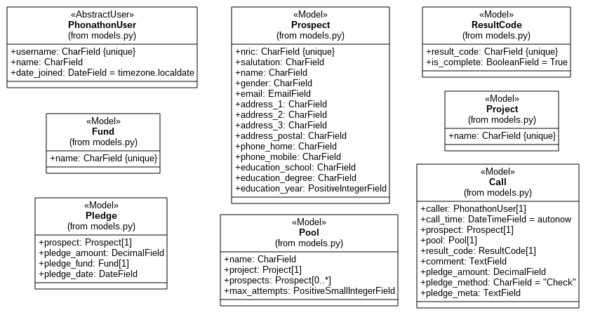

# phonathon

The system aims to provide a modern and free alternative to the current Campuscall system used in Phonathon.

## Overview

- The system would be implemented in Django 1.11, using Python 3.5+ on Linux
- A prototype would be hosted locally, using the Django development server with SQLite backend
- If possible, the prototype would be deployed on Google Cloud/ DigitalOcean, using PostgreSQL as the database backend

The current focus is on getting a minimum working example for presentation to stakeholders.

## Documentation

### Models

The following class diagram describes the models implemented in the project.

### Group-based Authentication

In this project, users are assigned groups (either Managers, Supervisors or Callers) and model permissions are assigned based on groups. The CRUD (Create-Read-Update-Delete) operations matrix is as below:

| | Managers | Supervisors | Callers
| -- | -- | -- | --
| User | CRUD | RU | R
| Prospect | CRUD | RU | RU
| Fund | CRUD | R | R
| Pledge | CRUD | R | R