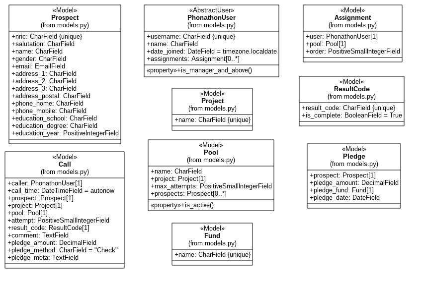

# phonathon

[](https://travis-ci.org/nguyenhuyanhh/phonathon)

The system aims to provide a modern and free alternative to the current Campuscall system used in Phonathon.

## Overview

- The system would be implemented in Django 1.11, using Python 3.5+ on Linux
- A prototype would be hosted locally, using the Django development server with SQLite backend
- If possible, the prototype would be deployed on Google Cloud/ DigitalOcean, using PostgreSQL as the database backend

The current focus is on getting a minimum working example for presentation to stakeholders.

## Documentation

### Setup Instructions (for development)

1. Clone this repository: 

```sh
git clone https://github.com/nguyenhuyanhh/phonathon.git
```

2. Install Python dependencies (including Django):

```sh
cd phonathon
pip3 install --user -r requirements.txt
```

3. Migrate the development database: 

```
python3 manage.py migrate
```

4. Run the development server:

```
python3 manage.py runserver
```

5. Visit [localhost:8000](localhost:8000) in a browser, or [localhost:8000/admin](localhost:8000/admin) to visit the admin site. Login using the superuser credentials, and make changes!

The project is developed using Python 3.5.2 on Lubuntu 16.04 LTS. Automated testing is done against the latest versions of Python and Django.

### URL Configuration

The following URLs are applicable to the project:

| URL | Description
| --- | ---
| `/` | Redirects to main calling interface 
| `/ccall` | Main calling interface
| `/admin` | Admin interface (accessible only to supervisors, managers and superusers)
| `/admin/upload` | Upload data (accessible only to managers and superusers)
| `/login` | Login
| `/logout` | Logout, redirects back to login

### Models

The following class diagram describes the models implemented in the project.



### Group-based Authentication

In this project, users are assigned groups (either Managers, Supervisors or Callers) and model permissions are assigned based on groups. The CRUD (Create-Read-Update-Delete) operations matrix is as below:

| | Managers | Supervisors | Callers
| -- | -- | -- | --
| User | CRUD | RU | R
| Prospect | CRUD | RU | RU
| Fund | CRUD | R | R
| Pledge | CRUD | R | R
| Project | CRUD | R | R
| Pool | CRUD | RU | R
| ResultCode | CRUD | R | R
| Call | CRUD | CRU | CR